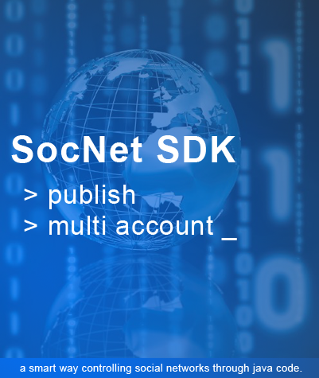

# SocNet SDK v3

known as Social Network Software Development Kit.
It has two different kinds of application:
1. library (*.jar)
2. small app (*.exe)

The SocNetSDK is also known as an automation library that help everyone to do social media post easily!

## For new comers
we suggest you to try out several tutorials given

1.[Non-Developers.](tutorials/non-developers)

2.[Developers.](tutorials/developers)

## For experts (developers)
we suggest to explore our nightly-build, as it's the latests applied changes.

1.[Nightly-Build.](https://github.com/fgroupindonesia/socnetsdkv3/tree/nightly-build)

# Corporate Usage
Interested to integrate into your business app? Email us : training[at]fgroupindonesia[dot]com
We're easy to have a contact by *Whatsapp* at +6285795569337 (accept international calls).
